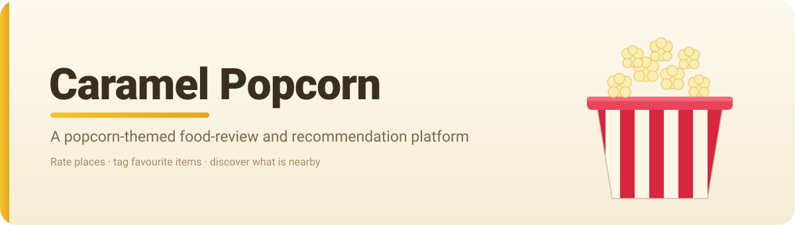
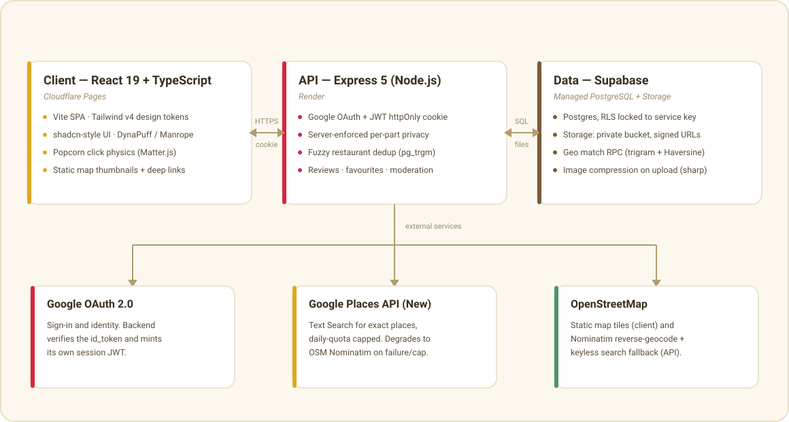

<p align="center">
  
</p>

# Caramel Popcorn

Caramel Popcorn is a food-review and recommendation platform with a bright, playful popcorn theme. Members log the places they visit, rate them across several metrics, tag the specific menu items worth ordering, and browse a shared, community-built restaurant database to decide where to eat next.

Its defining idea is a **two-part review**. Every review has an independent *Generic Review* (the star ratings and free text) and a *Favourite Items* list (the dishes you loved, with photos) — and **each part carries its own public/private toggle**. You can share your ratings while keeping your favourite dishes to yourself, or the other way around. Privacy is enforced on the server, never left to the client.

The restaurant database is **shared and deduplicated**: there is one entry per real place. Adding a restaurant runs a fuzzy name-and-location match first and surfaces a "Did you mean …?" prompt, so two branches of the same chain stay distinct while genuine duplicates are avoided.

## Features

- **Google sign-in** with a lightweight profile — avatar, name, and self-selected taste tags.
- **Two-part reviews** — multi-metric star ratings (food, service, price, ambiance) plus free text, and a separate favourite-items list, each independently public or private and enforced server-side.
- **Favourite-item photos** — uploaded images are compressed and stored in a private bucket, served through short-lived signed URLs so private dishes stay private.
- **Shared, deduplicated restaurant database** — fuzzy dedup on name + location proximity ("Did you mean …?") so the public list has one row per real place.
- **Exact-place picker** — search a place or drop a pin at your current location when adding a restaurant, capturing precise coordinates for accurate maps and distance.
- **Location-aware discovery** — browser geolocation with a saved-location fallback, plus distance, cuisine, and minimum-rating filters and sorting.
- **Static maps, no billable JS map** — static map thumbnails with a Google Maps deep link for turn-by-turn.
- **Reporting and moderation** — users flag reviews or places; an email-allowlisted admin works a moderation queue.
- **Signature popcorn click animation** — every click drops a physics-simulated popcorn kernel that falls, bounces, and piles up.

## Tech stack

| Layer            | Technology                                                        |
|------------------|-------------------------------------------------------------------|
| Frontend         | React 19, TypeScript, Vite, Tailwind CSS v4                        |
| UI system        | shadcn-style primitives, DynaPuff + Manrope (self-hosted), lucide  |
| Click animation  | Matter.js physics, sprites pre-rendered from 3D models            |
| Backend          | Node.js, Express 5 (ES modules)                                   |
| Database         | PostgreSQL via Supabase (Row Level Security)                       |
| File storage     | Supabase Storage (private bucket, signed URLs), sharp compression |
| Auth             | Google OAuth 2.0 with an app-issued JWT session cookie            |
| Place search     | Google Places API (New) Text Search, OpenStreetMap Nominatim fallback |
| Maps             | Static OpenStreetMap tiles + Google Maps deep links               |
| Hosting          | Cloudflare Pages (frontend), Render (backend)                     |

## Architecture

<p align="center">
  
</p>

The app is a monorepo of two independently deployed services talking over HTTPS.

- **Client (Cloudflare Pages)** — a React SPA. It renders the UI, holds no secrets, and calls the API with credentials so the session cookie flows automatically. Static map tiles are the only third-party asset it loads directly.
- **API (Render)** — an Express server that owns all trust. It runs the OAuth handshake, issues a JWT in an httpOnly cookie, and is the *only* thing that talks to the database. Every read applies the two per-part privacy flags before returning data, so a browser can never request another user's private content.
- **Data (Supabase)** — PostgreSQL with Row Level Security enabled and no policies, which locks the tables to the backend's service key. Restaurant dedup runs as a Postgres function combining trigram similarity with Haversine distance. Photos live in a private Storage bucket and are only ever exposed through expiring signed URLs.

**Session model.** The frontend and backend are deployed under one registrable domain (for example `popcorn.example.dev` and `api.popcorn.example.dev`). Because those are *same-site*, the `SameSite=Lax` httpOnly session cookie is sent on API calls without relying on third-party cookies — keeping the session both robust and secure.

**Place search with a cost ceiling.** Forward search uses Google Places API (New) for full coverage of every branch. A daily quota cap on the Google side guarantees usage never exceeds the free tier, and if a call fails or the cap is reached the server transparently falls back to keyless OpenStreetMap Nominatim, so search degrades gracefully instead of breaking. Reverse-geocoding always uses the free Nominatim path.

## Project structure

```
CaramelPopcorn/
├── frontend/          React 19 + Vite + Tailwind v4 SPA
│   ├── src/
│   │   ├── components/   UI primitives, Navbar, review + map widgets
│   │   ├── context/      Auth and Location providers
│   │   ├── pages/        Landing, Restaurants, RestaurantDetail, Profile, …
│   │   └── lib/          API client, geo + maps helpers
│   └── public/
├── backend/           Express 5 API (ES modules)
│   ├── src/
│   │   ├── routes/       Mounted under /api
│   │   ├── services/     Restaurants, reviews, favourites, reports, geocode
│   │   ├── middleware/    Auth, upload, error handling
│   │   └── config/       Centralised env + Supabase client
│   ├── db/migrations/    SQL schema + dedup RPC
│   └── scripts/          End-to-end test scripts
├── docs/              README assets (banner, architecture diagram)
└── CLAUDE.md          Working guide: product, conventions, deployment, decisions
```

## Local development

Requires Node.js 20+ and a Supabase project. Run the two apps in separate terminals.

```bash
# Backend  (http://localhost:4000)
cd backend
cp .env.example .env      # fill in Supabase, Google OAuth, and session secrets
npm install
npm run dev

# Frontend (http://localhost:5173)
cd frontend
cp .env.example .env      # set VITE_API_URL=http://localhost:4000/api
npm install
npm run dev
```

Then open http://localhost:5173, sign in with Google, and browse or add a place. The `backend/scripts/*-e2e.mjs` scripts exercise the API end to end.

## Deployment

Frontend deploys to Cloudflare Pages and the backend to Render, with the database already on Supabase. The full runbook — environment variables, custom-domain and cookie setup, OAuth and Places-key configuration, and a production smoke test — is in [`CLAUDE.md`](./CLAUDE.md#10-deployment--operations).

## License

Released under the [MIT License](./LICENSE).
